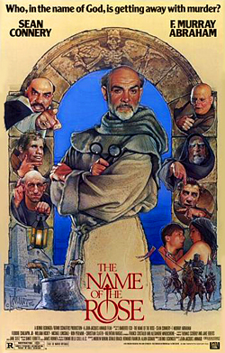

# Josephus' Problem

**🎯 Clear up murders in the monastery..**

In a monastery there are 1 assassin and the following 9 monks:

    :::python3
    monks = [
           "Adalbertus", "Bonifacius", "Commodus",
           "Dominicus", "Emarius", "Franziskus",
           "Gustavus", "Henrik", "Iohannes"
           ]

Every night the 5th monk is murdered (counting from the 1st monk or the last victim). The last monk catches the assassin.

Which monk will survive?

*Translated with [www.DeepL.com](www.DeepL.com/Translator)*
