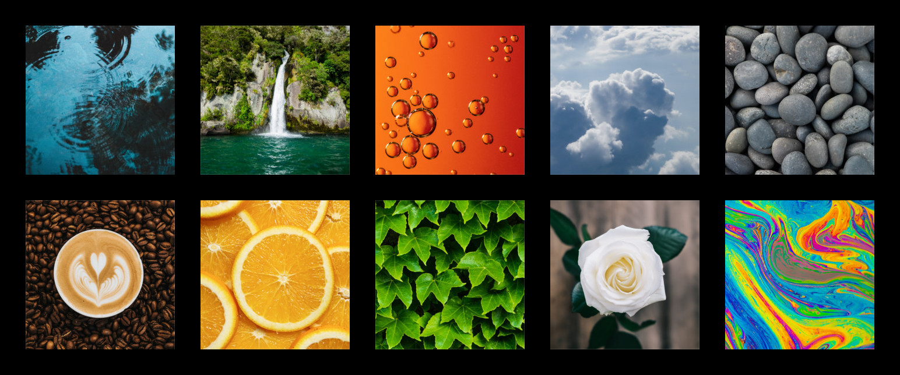

Memory
======

**🎯 Write a memory game in which a player uncovers pairs of cards using
the mouse or keyboard.**

|image0|

You can use the images in :download:`10images.zip`

The images have a 256 x 256 pixel size and are placed 300 pixels apart.

Hints
-----

-  the ``arcade`` library allows you to include graphics and act on user
   input.
-  you find more images on `unsplash.com <https://unsplash.com>`__ and
   `opengameart.org <https://opengameart.org/>`__.

*Translated with*\ `www.DeepL.com <https://www.DeepL.com/Translator>`__

Image sources
-------------

All images have been taken from `unsplash.com <https://unsplash.com>`__:

-  Bubbles by Marko Blažević on Unsplash
-  Coffee by Nathan Dumlao on Unsplash
-  Ivy by asoggetti on Unsplash
-  Orange by Vino Li on Unsplash
-  Rainbow paint by Daniel Olah on Unsplash
-  Pebbles by John Salzarulo on Unsplash
-  Waterfall by Ben Guerin on Unsplash
-  Clouds by Zbynek Burival on Unsplash
-  White flower by Annie Spratt on Unsplash
-  Puddle by Erik Mclean on Unsplash

