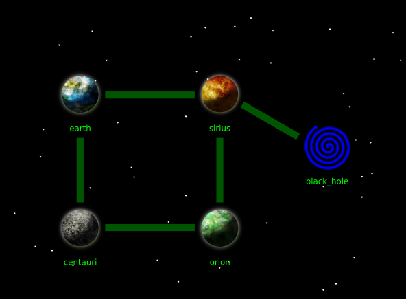

Revisit Python Basics
=====================

In this chapter, you will take a short tour through those parts of Python you may be familiar with from basic Python lessons.
These include:

* variables
* basic data types such as `str`, `int`, `bool`
* data structures such as `list`, `dict` and `tuple`
* a few built-in functions

This is a good opportunity for you to check your knowledge and find out gaps if necessary.

Exercise 1: The Space Game
---------------------------

Let's consider the prototype of a space traveling game.
In the game, you move from planet to planet and solve a few simple puzzles.
It is a small example program that contains many basic Python features.

Examine the code in :download:`space_game.py` .
Open it in your code editor and try to run the program.
You should notice that the program **fails**.
In fact, it is full of bugs: there are at least 10 of them.

.. hint::

    If you are using **Visual Studio Code**, it is a good idea to activate the **Pylance** plugin from the **Extensions Panel** on the left side. Pylance will highlight a lot of issues right away.
    For more specific help with data types, also set the **Type Checking Mode** to **Standard**.

Exercise 2: Debugging
---------------------

Try to find and fix all bugs, so that the game runs.

Exercise 3: Test
----------------

The game comes with a set of Unit Tests. You find them in the file :download:`test_space_game.py` . Place the file in the same folder with the code.

Run the tests with:

::

    python -m pip install pytest
    python -m pytest

Exercise 4: Code Review
-----------------------

The code of the game is actually not that great.
What are the most important areas for improvement?

.. seealso::

    In my `Python Basics Tutorial <https://www.academis.eu/python_basics>`__ you find these topics explained in more detail.
