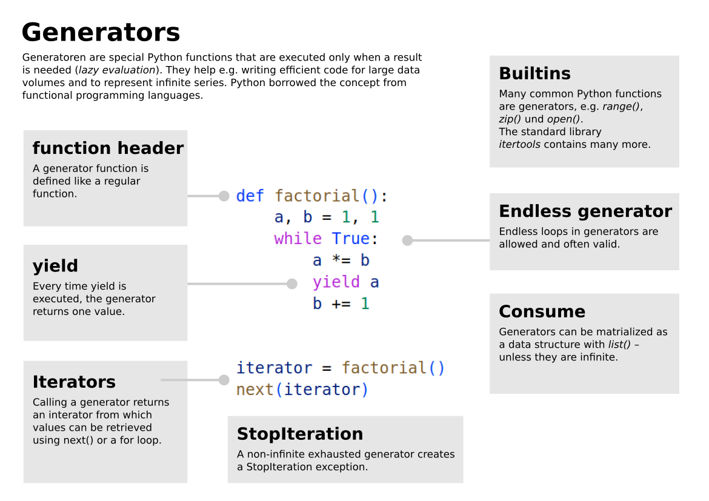

Generators
==========

Generators are *lazy* functions. They produce results like normal
Python functions, but only when they are needed. The main purpose of
using generators is to save memory and calculation time when processing
big datasets.

A Python generator is indicated by the ``yield`` keyword.
A ``return`` statement in a generator function still terminates it.

----

A minimalistic example
----------------------

Calling the ``powers()`` function initializes the generator. Every time
``next()`` is called, it pulls out one value from the generator.

.. code:: python3

   def powers():
       yield 1
       yield 2
       yield 4
       yield 8
       yield 16

   gen = powers()    
   print(next(gen))
   print(next(gen))
   print(next(gen))

--------------

Lazy evaluation
---------------

Note that the results of the generator are not pre-calculated. Every
call of ``next()`` executes the code inside the generator function until
it encounters the next ``yield`` statement.

The following code proves that:

.. code:: python3

   def count():
       for i in range(10):
           print('checkpoint A')
           yield i

   gen = count()
   print('checkpoint B')
   print(next(gen))
   print(next(gen))

The first call of the generator does nothing yet. Only when ``next()``
requests the next value, the generator function is executed until the
``yield`` statement. Then it pauses until the next ``yield`` and so on.

--------------

Consuming values
----------------

To get all values out of a generator, you can use a ``for`` loop or
convert to a list:

.. code:: python3

   for x in count():
        print(x, )

   print(list(count()))

--------------

Endless loops
-------------

A common generator pattern is using an endless ``while`` loop to
generate a series.

.. code:: python3

   def powers():
       """generates infinite powers of two"""
       n = 1
       while True:
           yield n
           n *= 2

Pulling out values with ``next()`` does not result in an endless loop.
Of course, you shouldn’t try to consume this generator in a loop or
using ``list()``.

--------------

Generator Expressions
---------------------

You can create ad-hoc generators similar to a list comprehension:

.. code:: python3

   squares = (x ** 2 for x in range(100))

   print(next(squares))

--------------

Iterators
---------

The thing returned by a generator is called an **iterator**. Many
functions in Python return iterators (e.g. ``range()``, ``enumerate()``
and ``zip()``).

Among the things you can do to iterators are:

-  request values with ``next``.
-  use them in a ``for`` loop.
-  convert them to lists with ``list()``.

The ``iter()`` function creates a generator from any iterable:

.. code:: python3

   gen = iter("Hello World")
   print(next(gen))  # -> 'H'
   print(next(gen))  # -> 'e'

Exercise: Ticker
----------------

Run the code in :download:`ticker.py`.
Understand what it does.

Use the ticker in the main loop of the Pac game to slow down the movement.
Follow these steps:

- place the ticker function in the code
- create a new ticker with a delta of 0.1 before the `while` loop.
- inside the loop, use `next()` to retrieve the next value from the ticker.
- move the pac only if the tick value is `True`
- experiment with the 
