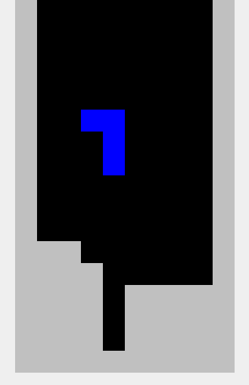

Refactor a Tetris game
======================

In :download:`tetris.py`, you find a complete Tetris game.
It makes heavy use of the Numpy library.
The code almost has no structure.

Create functions with reasonable names to make the code cleaner.

.. note::

   There is also a bug when dropping long bricks to the ground.
   Maybe the refactoring makes this issue easier to debug.
