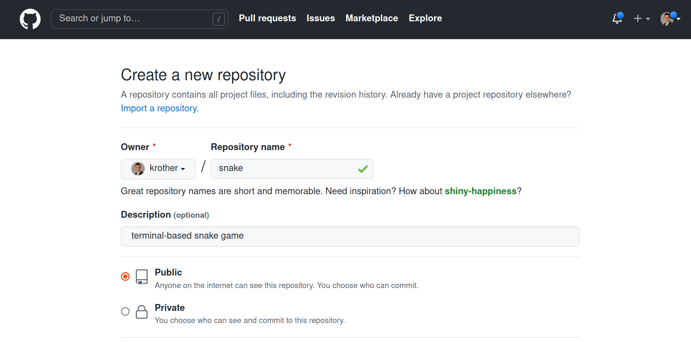
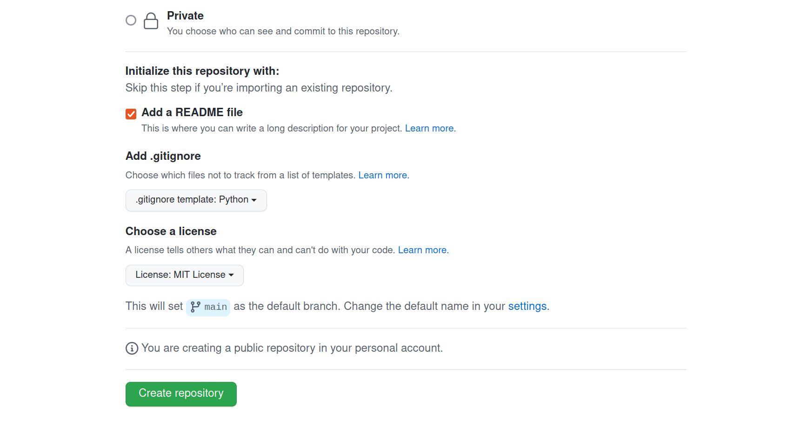
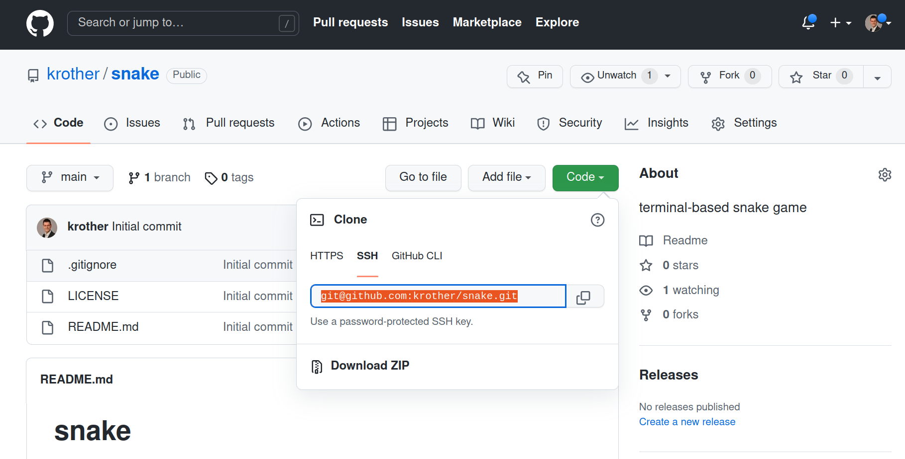

Set up a GitHub Repository
==========================

Version Control is in my opinion the single most important tool of
modern software development. Most of the time, using Version Control
means using **git**. In this recipe, you will set up your own project
repository on `GitHub <https://www.github.com>`__.

I won’t be describing here what git is or how to use it. There are lots
of high quality tutorials for it. If you have never used git before or
need a refresher, check out the `Introduction to Git and
GitHub <https://realpython.com/python-git-github-intro/>`__ by Jim
Anderson.

Let’s go through the steps setting git/GitHub for your project:

Step 1: Create a repository
~~~~~~~~~~~~~~~~~~~~~~~~~~~

There are two ways to create a new repository:

1. using the GitHub website
2. using ``git init`` in the terminal

I recommend starting on GitHub, because you can create a couple of
useful files there right away.

Log in to your account on `github.com <https://www.github.com>`__ (or
create one if you are there for the first time). Then, find the **button
with a big plus (+)** in the top right corner and select **New
Repository**. You should see a dialog where you can enter the name and
description of your project:

I recommend you use names in ``lowercase_with_underscores``. This may
avoid random bugs on some operating systems.

Step 2: Decide whether your project is public
~~~~~~~~~~~~~~~~~~~~~~~~~~~~~~~~~~~~~~~~~~~~~

When you scroll down the creation dialog, there are several control
boxes. The first one selects whether your project is visible to the rest
of the world. There is a simple guideline:

-  If your project is work for a company or you feel you want to keep it
   confidential, choose **Private**.
-  If you would like to share it, choose **Public**.

It is fine to have public projects that are *incomplete*, *simple* or
*not practically useful*. Having a simple project that is cleaned up
well may be a good advertisement. The Private/Public setting is easy to
change later on as well.

Step 3: Add a README file
~~~~~~~~~~~~~~~~~~~~~~~~~

This is a no-brainer. Tick this box.

Step 4: Add a .gitignore file
~~~~~~~~~~~~~~~~~~~~~~~~~~~~~

The ``.gitignore`` file prevents that many types of temporary or
auto-generated files are added to your repository. It is another
must-have. Choose **Python** from the dialog.

Step 5: Choose a license
~~~~~~~~~~~~~~~~~~~~~~~~

GitHub offers a selection of time-tested open-source licenses. They are
legally watertight, but differ in subtle aspects. For a hobby project, I
recommend the **MIT License**. It roughly says:

-  other people may use your code for whatever they want
-  they have to keep the MIT License in
-  you cannot be held legally liable

If you find out later that you need a different license, you as the
author are allowed to change it.

Step 6: Create the repo
~~~~~~~~~~~~~~~~~~~~~~~

Now you are ready to go. The dialog should look similar to this:

Press the **Create Repository** button. After a few seconds, you should
see a page listing the files in your new project repo:

::

   .gitignore
   LICENSE
   README.md

Step 7: Clone the repository
~~~~~~~~~~~~~~~~~~~~~~~~~~~~

Next, create a local working copy of your project. For that, you need to
**clone** the repository. You need to have git installed on your
computer. You find a `git installation guide on
git-scm.com <https://git-scm.com/book/en/v2/Getting-Started-Installing-Git>`__.

To clone the repository, you need the address under the big button
labeled **Code**:

Do the following:

1. Copy the address starting with ``git@github..`` from the GitHub page
2. Open a terminal on your computer
3. Use ``cd`` to navigate to the folder where you keep your projects
4. Type ``git clone`` followed by the address you just copied

You should see a message similar to:

::

   kristian@mylaptop:~/projects$ git clone git@github.com:krother/snake.git
   Cloning into 'snake'...
   remote: Enumerating objects: 5, done.
   remote: Counting objects: 100% (5/5), done.
   remote: Compressing objects: 100% (4/4), done.
   Receiving objects: 100% (5/5), done.
   remote: Total 5 (delta 0), reused 0 (delta 0), pack-reused 0

There also should be a new folder:

::

   kristian@mylaptop:~/projects$ ls -la snake
   total 24
   drwxrwxr-x  3 kristian kristian 4096 Mai 28 11:33 .
   drwxrwxr-x 50 kristian kristian 4096 Mai 28 11:33 ..
   drwxrwxr-x  8 kristian kristian 4096 Mai 28 11:33 .git
   -rw-rw-r--  1 kristian kristian 1799 Mai 28 11:33 .gitignore
   -rw-rw-r--  1 kristian kristian 1072 Mai 28 11:33 LICENSE
   -rw-rw-r--  1 kristian kristian   35 Mai 28 11:33 README.md

Step 8: Add your code
~~~~~~~~~~~~~~~~~~~~~

Now you can start adding code to your repository. For instance you could
add a prototype if you have one. The sequence of commands might look
like this:

::

   cd snake/
   cp ~/Desktop/prototype.py .
   git status
   git add prototype.py 
   git commit -m "add a snake prototype"
   git push

To exectute ``git push``, you may need to `Add SSH keys to your GitHub
account <https://help.github.com/articles/adding-a-new-ssh-key-to-your-github-account/>`__.

In the end, you should see the code of your prototype on your GitHub
page. **Congratulations!**

.. seealso::

   -  `Git Introduction <https://realpython.com/python-git-github-intro/>`__
   -  `Try GitHub - Online-Tutorial <https://try.github.io/>`__
   -  `Pro Git <https://git-scm.com/book/en/v2>`__ – the book by Scott Chacon
