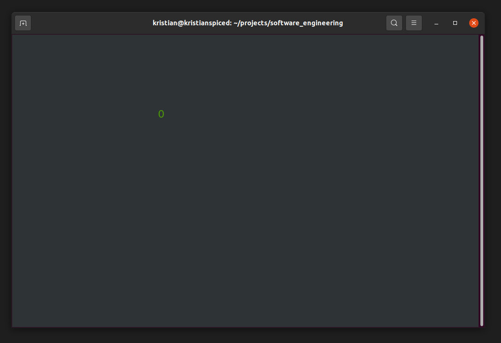

The Prototype
=============

Before attempting a costly clean implementation, you may want to
check whether the project is feasible at all. You can do such a check by
implementing a quick and dirty proof of concept: a **prototype**. 
The goal of a prototype is usually to reduce risks in a project.

A prototype can answer questions like:

-  is my programming environment set up properly?
-  can we solve a particular algorithmic problem?
-  does a library do what we need?
-  is the algorithm/library fast enough?
-  what safety/security risks are there?
-  did we understand the customer correctly?

A Prototype for a Dungeon Explorer game
---------------------------------------

Let's look at a prototype for a Dungeon Explorer game.
In the program you move a graphical icon using the keyboard.
The goal of this prototype is to prove that you can process keyboard input
and draw 2D graphics.

The prototype helps us to get rid of installation issues right away.

Exercise 1: Save the code
-------------------------

Save the code in :download:`prototype_opencv.py` to a Python file.

Exercise 2: Install Dependencies
--------------------------------

You need to install some libraries.
Open a terminal (on Windows: Anaconda Prompt) and type:

::

   pip install numpy python-opencv

.. hint::

   In case the installation, try the fallback code in :download:`prototype_curses.py`.
   That second prototype runs in the terminal and does not require OpenCV.

   On Windows, you need to install ``windows-curses`` though:

   ::
   
      pip install windows-curses
   

Exercise 3: Execute the prototype
---------------------------------

Change to the directory with the ``.py`` file and execute the code with:

::

   python prototype_opencv.py

You should see a screen where you can control the ``'O'`` with the keys **A and D**:

Exercise 4: Code Review
-----------------------

Inspect the Python file. Take notes to answer the following questions:

* What do you like about the code?
* What do you not like about the code?
* What would you like to know more about?

Exercise 5: Modify
------------------

Add the two missing directions.

Reflection Questions
--------------------

Discuss the following questions:

-  Can you think of any software projects with special risks?
-  Could these risks be mitigated by writing a prototype?
-  Do you know other engineering disciplines where prototypes are used?
