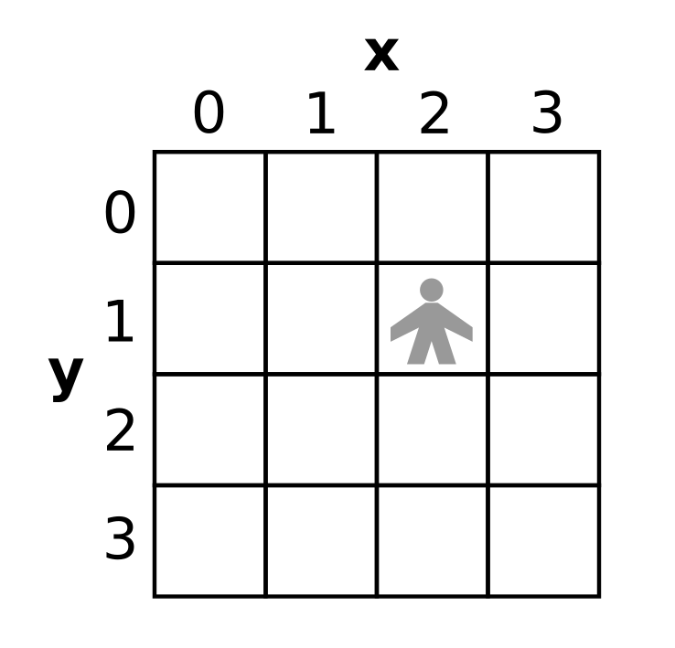
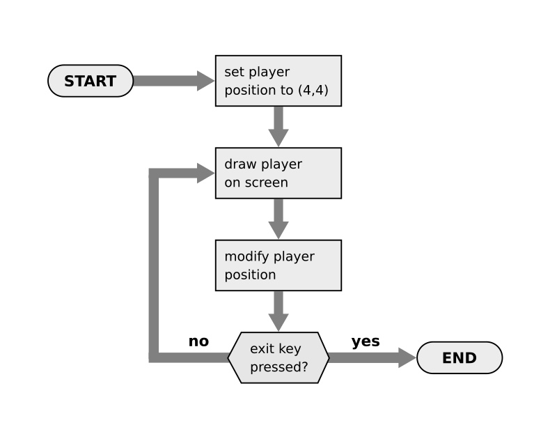

The Dungeon Explorer Game
=========================

*image generated with dreamstudio*

In the following chapters, we will write a small game called **Dungeon Explorer**.
Writing a game is a great way to both become better at programming and to exemplify a systematic approach to programming.

What Software Development is about
----------------------------------

.. image:: software_engineering.png

Software development is more than writing code.
While most courses and online resources focus very much on the process of writing code,
it is easy to forget that several things that are necessary before the code can be written:

* an **idea** that provides a reason for the program to exist (*"why"*)
* **requirements** that describe what the program should do (*"what"*)
* a **design** that describes core mechanics of the program (*"how"*)
* the actual **implementation**

When moving from the idea towards code, one gradually translates the informal, prose description of the problem into a *formal language*. Much of it requires gaining a deeper understanding of a task that is unknown at first. This is what much of a software developers work is really about.

In a simple program, like many learning examples and coding challenges, the first three steps are nonexistent or at least very easy. 
In any real-world software project, the first three steps are often more difficult than the implementation.
When writing requirements or designing a program, the software developer does not only have to find a path that brings the original idea to life, but also anticipate what forces the software will have to adapt to in the future.

Let's look at an example of how the first three steps would look for a **Dungeon Explorer** game:

The Idea
--------

*"In the Dungeon Explorer game, an adventurer roams a dungeon, solves puzzles, avoids traps and finds treasures."*

The Requirements
----------------

Here is a short example of how the idea could be fleshed out more:

1. User Interface
~~~~~~~~~~~~~~~~~

=== ==============================================================
#   description
=== ==============================================================
1.1 The dungeon is seen from the top as a 2D grid
1.2 The dungeon is drawn from square graphic tiles
1.3 The adventurer is controlled by the player by pressing keys
=== ==============================================================

2. Dungeon Elements
~~~~~~~~~~~~~~~~~~~

=== ==============================================================
#   description
=== ==============================================================
2.1 walls are impassable
2.2 an exit square leads to the next level
2.3 keys that are needed to open doors
=== ==============================================================

3. Traps
~~~~~~~~

=== ==============================================================
#   description
=== ==============================================================
3.1 if the player falls into a pit, they die
3.2 if the player steps into green slime, they lose health
3.3 there are fireballs that travel in straight lines
=== ==============================================================

The Design
----------

Two key elements of the game deserve to be described better.
First, the grid that is used for the dungeon is based on *integer x/y coordinates*:

Second, the following **flowchart** describes how the program actually works:

.. note::

   At this point, we have not decided what libraries or even what programming language to use. This is good, because the design makes the task more specific without constraining the developer.

These are just two examples of design techniques.
For a first implementation, see the next chapter.

Reflection Questions
--------------------

- which of the in the software development diagram could be automated with the help of a Large Language Model (LLM)?