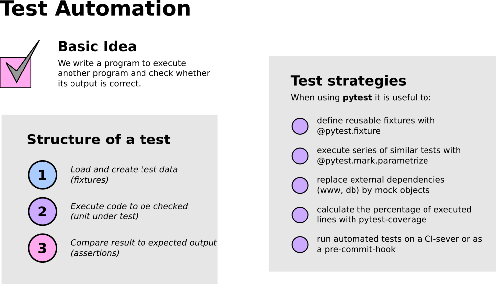
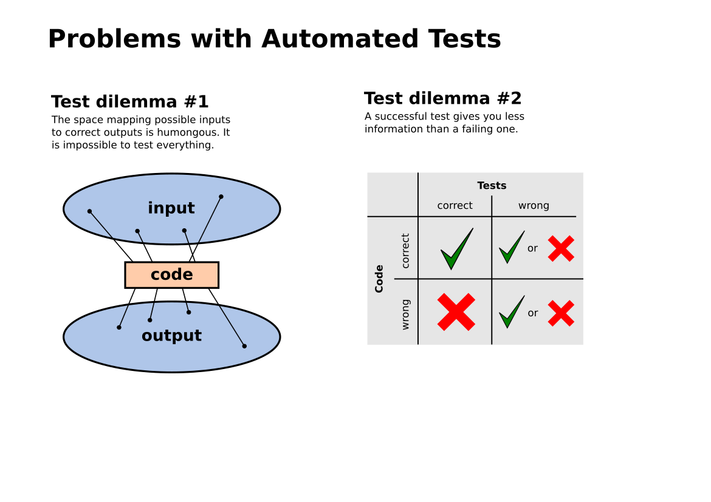

Test Automation
===============

Exercise 1: Automated Tests
---------------------------

In :download:`test_words.py` you find an examples of:

- a simple test with pytest
- a test against an Exception
- a test with a fixture
- a parametrized test

Run the tests with

::

  uv run pytest

Make the tests work by implementing a `word_count()` function.

Exercise 2: Roman Numerals
--------------------------

Write a test for a function that convert Roman numerals (e.g. `XVI`) to arabic numbers.

Then implement the minimal code to make the test pass.

Iterate a few times.

Exercise 3: Tests for the Space Game
------------------------------------

Run the tests for the space game with the following command:

::

  uv run pytest -v -x -s --cov

Explain the options.

Exercise 4: Mocking
-------------------

Also compare the code in :download:`mock_example.py`
Discuss what a **context manager** is.

.. seealso::

   - `Test Automation <https://python-basics-tutorial.readthedocs.io/en/latest/test/index.html>`__
   - `Pytest usage guide <https://python-basics-tutorial.readthedocs.io/en/latest/test/pytest/index.html>`__
   - `Pytest library <https://docs.pytest.org>`__
   - `Tutorial by Kristian <https://www.academis.eu/python_testing/>`__
   - `Playwright <https://playwright.dev/python/>`__
